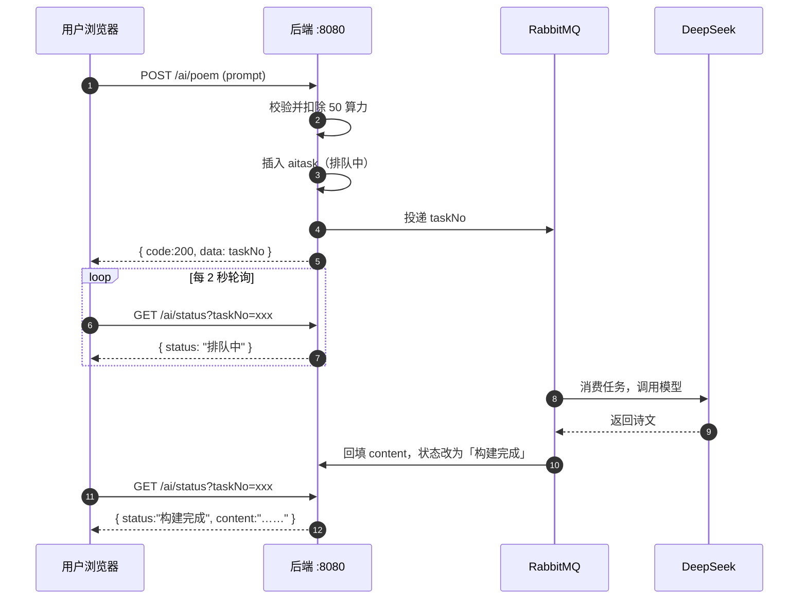
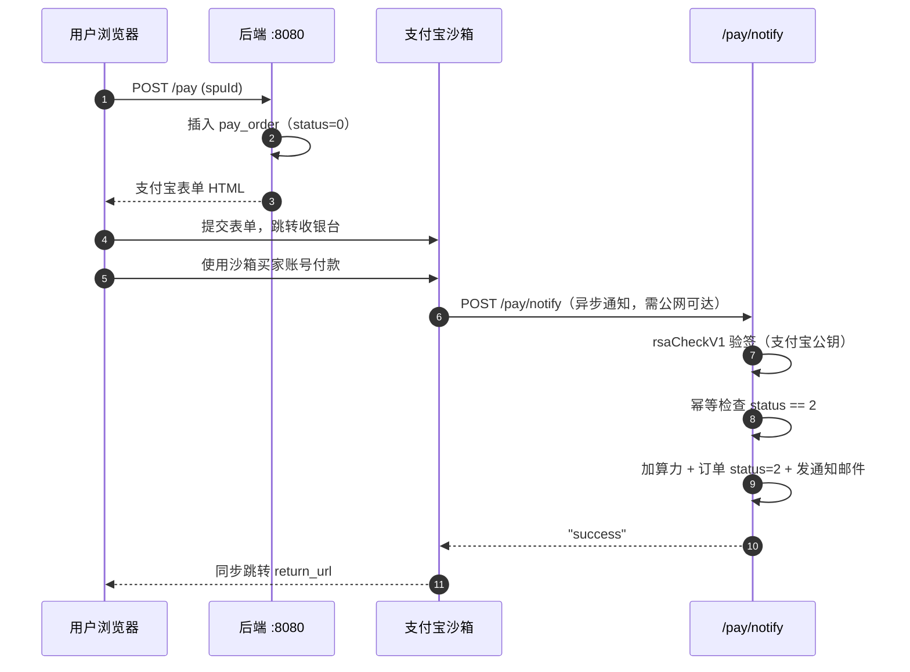

# AI 算力租赁平台 · 接口文档

后端 Spring Boot 3 + MyBatis-Plus，前端 Vue 3 + Vite。
本文档覆盖全部 **25 个** HTTP 接口端点。

---

## 目录

- [一、技术栈与运行环境](#一技术栈与运行环境)
- [二、通用约定](#二通用约定)
- [三、接口总览](#三接口总览)
- [四、接口详情](#四接口详情)
  - [4.1 认证 `/check`](#41-认证-check)
  - [4.2 用户 `/user`](#42-用户-user)
  - [4.3 套餐 `/spu`](#43-套餐-spu)
  - [4.4 AI 创作 `/ai`](#44-ai-创作-ai)
  - [4.5 支付 `/pay`](#45-支付-pay)
  - [4.6 管理端 `/admin`](#46-管理端-admin)
- [五、数据模型](#五数据模型)
- [六、核心业务流程](#六核心业务流程)
- [七、已知问题](#七已知问题)
- [八、测试账号](#八测试账号)

---

## 一、技术栈与运行环境

| 项 | 值 |
| --- | --- |
| 后端框架 | Spring Boot 3.0.2 |
| JDK | **17 及以上**（Lombok 1.18.30 不支持 JDK 25） |
| 持久层 | MyBatis-Plus |
| 数据库 | MySQL 8 |
| 缓存 | Redis（验证码、签到状态） |
| 消息队列 | RabbitMQ（AI 写诗任务） |
| AI 能力 | Spring AI + DeepSeek |
| 支付 | 支付宝开放平台（沙箱环境） |
| 后端端口 | `8080` |
| 前端端口 | `5173`（Vite） |

### 启动前必须设置的 6 个环境变量

`application.yml` 中全部为 `${...}` 占位符，缺一个后端启动即失败：

| 变量 | 用途 |
| --- | --- |
| `DEEPSEEK_API_KEY` | Spring AI 调用 DeepSeek |
| `EMAIL` | 发件邮箱（`spring.mail.username`） |
| `PWD` | 发件邮箱授权码（`spring.mail.password`） |
| `ALIPAY_APP_ID` | 支付宝应用 ID |
| `ALIPAY_APP_PRIVATE_KEY` | 应用私钥（PKCS8 单行 Base64） |
| `ALIPAY_PUBLIC_KEY` | 支付宝公钥 |

> Windows 下修改用户级环境变量后，**已运行的进程不会刷新环境块**，必须完全退出 IDE 再重开。

---

## 二、通用约定

### 2.1 请求地址

| 场景 | Base URL | 说明 |
| --- | --- | --- |
| 直连后端 | `http://localhost:8080` | 本文档所有路径均相对于此 |
| 前端开发环境 | `/api` | Vite 代理转发到 `:8080`，**转发时抹掉 `/api` 前缀** |

```
浏览器 → localhost:5173/api/check/login
         ↓ Vite 代理（rewrite 去掉 /api）
后端   → localhost:8080/check/login
```

后端未配置 CORS，前端必须通过代理保持同源，否则 `JSESSIONID` Cookie 无法携带。

### 2.2 请求格式

**所有 POST 接口均使用表单参数**（`Content-Type: application/x-www-form-urlencoded`）。
后端 Controller 方法签名是散装参数，没有 `@RequestBody` —— **用 JSON 提交会让后端所有参数收到 `null`**。

### 2.3 认证方式

基于 `HttpSession`（Cookie `JSESSIONID`），**不使用 JWT**。

- 登录成功后服务端写入 Session（`session.setAttribute("user", username)`）
- 后续请求由浏览器自动携带 Cookie
- 修改用户名成功后，服务端会**同步刷新 Session**，无需重新登录

### 2.4 统一响应结构

除少数例外（见 2.5），所有接口返回：

```json
{
  "code": 200,
  "msg": "success",
  "data": {}
}
```

| 字段 | 类型 | 说明 |
| --- | --- | --- |
| `code` | int | `200` 成功；`500` 业务失败 |
| `msg` | string | 提示信息 |
| `data` | 泛型 | 业务数据；失败时为 `null` |

> `code` 是**业务码**，HTTP 状态码通常都是 `200`（除非后端抛未捕获异常）。

### 2.5 非标准响应（重要）

以下情况的响应体**不符合** `Result` 结构，前端需单独兼容：

| 情况 | 响应体 | HTTP |
| --- | --- | --- |
| 未登录 | `{"msg":"请先登录"}`（**无 `code` 字段**） | 200 |
| Session 用户已不存在 | `{"msg":"用户不存在，请重新登录"}`（无 `code`） | 200 |
| 非管理员访问 `/admin/**` | **空响应体**（拦截器直接 `return false`，不写任何内容） | 200 |
| `POST /ai/upload` 成功 | **空响应体**（代码里直接 `return null`） | 200 |
| `POST /admin/revisespu/status` 更新 0 行 | **空响应体** | 200 |
| `POST /pay` 成功 | **支付宝表单 HTML 字符串**，不是 JSON | 200 |
| 后端抛未捕获异常 | Spring `/error`：`{timestamp, status, error, path, trace}` | 500 |

> 区分「未登录」和「后端炸了」要看 **HTTP 状态码 + 有无 `status`/`error` 字段**，
> 两者都长得像 JSON 但语义完全相反。

### 2.6 权限矩阵

| 路径 | 需登录 | 需 admin 角色 | 拦截器 |
| --- | :---: | :---: | --- |
| `/check/login` | - | - | 放行 |
| `/check/register` | - | - | 放行 |
| `/check/sendcode` | - | - | 放行 |
| `/spu/list` | - | - | 放行 |
| `/pay/notify` | - | - | 放行（安全由验签保证） |
| `/admin/**` | 是 | **是** | `loginintercepter` + `adminintercepter` |
| 其余全部 | **是** | - | `loginintercepter` |

拦截器拦截路径为 `/**`，放行名单：
`/check/login`、`/check/register`、`/check/sendcode`、`/spu/list`、`/pay/notify`、
`/index.html`、`/static/**`、`/`、`/css/**`、`/js/**`、`/images/**`、`/mail/**`、`/error`

> `/error` 必须放行：Controller 抛异常时 Spring 会转发到 `/error`，
> 若被拦截器拦下，客户端只会看到「请先登录」，真实 500 会被完全掩盖。

---

## 三、接口总览

| # | 方法 | 路径 | 说明 | 需登录 |
| --- | --- | --- | --- | :---: |
| 1 | POST | `/check/login` | 登录（账密 / 邮箱验证码） | - |
| 2 | GET | `/check/sendcode` | 发送邮箱验证码 | - |
| 3 | POST | `/check/register` | 注册 | - |
| 4 | POST | `/check/logout` | 退出登录 | 是 |
| 5 | POST | `/check/sign` | 每日签到领 100 算力 | 是 |
| 6 | GET | `/user/profile` | 查看个人信息 | 是 |
| 7 | POST | `/user/profile` | 修改用户名 / 密码 | 是 |
| 8 | POST | `/user/email` | 绑定邮箱 | 是 |
| 9 | GET | `/user/aitask` | 查看自己的 AI 任务 | 是 |
| 10 | GET | `/spu/list` | 已上架套餐列表 | - |
| 11 | POST | `/ai/poem` | 提交 AI 写诗任务 | 是 |
| 12 | GET | `/ai/status` | 轮询任务状态与结果 | 是 |
| 13 | GET | `/ai/show/list` | 作品列表（按热度） | 是 |
| 14 | GET | `/ai/show/{id}` | 作品详情（浏览量 +1） | 是 |
| 15 | POST | `/ai/upload` | 上传作品到广场 | 是 |
| 16 | POST | `/pay` | 创建订单，返回收银台表单 | 是 |
| 17 | POST | `/pay/notify` | 支付宝异步通知回调 | - |
| 18 | GET | `/admin/read` | 查询所有用户 | admin |
| 19 | POST | `/admin/revise` | 修改用户角色 / 算力 | admin |
| 20 | GET | `/admin/readai` | 查看所有 AI 任务 | admin |
| 21 | POST | `/admin/addspu` | 新增套餐（初始下架） | admin |
| 22 | GET | `/admin/readspu` | 查看全部套餐（含下架） | admin |
| 23 | POST | `/admin/revisespu` | 修改套餐信息 | admin |
| 24 | POST | `/admin/revisespu/status` | 上架 / 下架套餐 | admin |
| 25 | POST | `/admin/deletespu` | 删除套餐 | admin |

---

## 四、接口详情

### 4.1 认证 `/check`

#### 4.1.1 登录

```
POST /check/login
```

支持两种方式，由 `type` 字段区分。

| 参数 | 类型 | 必填 | 说明 |
| --- | --- | --- | --- |
| `type` | int | 是 | `1` = 账号密码登录；`2` = 邮箱验证码登录 |
| `username` | string | type=1 | 用户名 |
| `password` | string | type=1 | 密码 |
| `email` | string | type=2 | 已绑定的邮箱 |
| `code` | string | type=2 | 邮箱验证码 |

**成功响应**

```json
{ "code": 200, "msg": "success", "data": "登录成功" }
```

**失败响应**

| msg | 触发条件 |
| --- | --- |
| `用户不存在` | 用户名在库中不存在 |
| `密码错误` | 密码不匹配 |
| `验证码已过期` | Redis 中无该邮箱的验证码 |
| `验证码错误` | 验证码不匹配 |

> 登录成功后服务端写入 Session，浏览器保存 `JSESSIONID` Cookie。

---

#### 4.1.2 发送邮箱验证码

```
GET /check/sendcode?email=user@example.com
```

| 参数 | 类型 | 必填 | 说明 |
| --- | --- | --- | --- |
| `email` | string | 是 | 必须是**已绑定**到某个用户的邮箱 |

验证码存入 Redis，有效期 **2 分钟**。

**成功响应**

```json
{ "code": 200, "msg": "success", "data": "发送验证码成功,请在120s内输入" }
```

**失败响应**

| msg | 触发条件 |
| --- | --- |
| `该邮箱未绑定用户` | 库中无用户绑定该邮箱 |
| `发送验证码失败` | SMTP 发送异常（已验证码已写入 Redis） |

---

#### 4.1.3 注册

```
POST /check/register
```

| 参数 | 类型 | 必填 | 说明 |
| --- | --- | --- | --- |
| `username` | string | 是 | 用户名 |
| `password` | string | 是 | 密码 |

新用户默认 `money = 0`、`role = "user"`。

**成功响应**

```json
{ "code": 200, "msg": "success", "data": "注册成功" }
```

**失败响应**：`用户已存在` / `注册失败`

> 后端未校验用户名密码是否为空（见[已知问题](#七已知问题)）。

---

#### 4.1.4 退出登录

```
POST /check/logout
```

无参数，服务端执行 `session.invalidate()`。

```json
{ "code": 200, "msg": "success", "data": "退出成功" }
```

---

#### 4.1.5 每日签到

```
POST /check/sign
```

无参数，身份取自 Session。每次 **+100 算力**，每个自然日限一次。

签到标记以用户名为 key 写入 Redis，过期时间为**次日 00:00**。

**成功响应**

```json
{ "code": 200, "msg": "success", "data": "每日签到领取100算力成功" }
```

**失败响应**

| msg | 触发条件 |
| --- | --- |
| `未登录` | Session 中无用户 |
| `今天已签到,请明日再来` | Redis 中已存在今日标记 |

---

### 4.2 用户 `/user`

#### 4.2.1 查看个人信息

```
GET /user/profile
```

无参数，身份取自 Session。

**成功响应**

```json
{
  "code": 200,
  "msg": "success",
  "data": {
    "id": 1,
    "username": "demo",
    "password": "123456",
    "money": 500,
    "email": "user@example.com",
    "role": "user"
  }
}
```

> 返回体包含**明文 `password` 字段**，见[已知问题](#七已知问题)。

---

#### 4.2.2 修改用户名 / 密码

```
POST /user/profile
```

| 参数 | 类型 | 必填 | 说明 |
| --- | --- | --- | --- |
| `username` | string | 否 | 新用户名，留空则不修改 |
| `password` | string | 否 | 新密码，留空则不修改 |

- 新用户名与库中已有用户重名时被拒绝
- 修改成功后服务端**同步刷新 Session**，无需重新登录
- 仅更新显式传入的字段，**不会影响算力等其它数据**

**成功响应**

```json
{ "code": 200, "msg": "success", "data": "修改成功" }
```

**失败响应**

| msg | 触发条件 |
| --- | --- |
| `用户名已存在` | 新用户名已被占用 |
| `与先前数据相同，修改失败` | 更新影响行数为 0 |

---

#### 4.2.3 绑定邮箱

```
POST /user/email
```

| 参数 | 类型 | 必填 | 说明 |
| --- | --- | --- | --- |
| `email` | string | 是 | 待绑定的邮箱 |

绑定后可用于邮箱验证码登录，以及接收购买成功通知邮件。

**成功响应**

```json
{ "code": 200, "msg": "success", "data": "绑定成功" }
```

**失败响应**：`请勿绑定相同信息`

---

#### 4.2.4 查看自己的 AI 任务

```
GET /user/aitask
```

**无任何入参** —— 身份完全取自 Session，接口不接受用户名参数，因此不存在
「传别人的名字遍历他人创作记录」的口子。结果按最新在前排序。

**成功响应**

```json
{
  "code": 200,
  "msg": "success",
  "data": [
    {
      "id": 4,
      "taskname": "ai写诗",
      "username": "demo",
      "prompt": "创作一首五言律诗",
      "status": "构建完成",
      "content": "寒窗听夜雨，孤灯照影深。\n风卷残叶去，秋声入梦沉。",
      "taskNo": "3f2b8c1e-9d4a-4f6b-8c2e-1a7b6d5e4f3c"
    }
  ]
}
```

---

### 4.3 套餐 `/spu`

#### 4.3.1 已上架套餐列表

```
GET /spu/list
```

**公开接口，无需登录**。服务端已过滤 `status = 1`（仅上架套餐）。

> 浏览放宽不代表交易放宽 —— 下单接口 `POST /pay` 仍要求登录。

**成功响应**

```json
{
  "code": 200,
  "msg": "success",
  "data": [
    { "id": 6, "name": "基础算力包", "money": 500, "rmb": 5, "status": 1 }
  ]
}
```

---

### 4.4 AI 创作 `/ai`

#### 4.4.1 提交 AI 写诗任务

```
POST /ai/poem
```

| 参数 | 类型 | 必填 | 说明 |
| --- | --- | --- | --- |
| `prompt` | string | 是 | 创作提示词，**最长 255 字符** |

执行流程：校验并扣除 **50 算力** → 插入 `aitask`（状态「排队中」）→ 投递 RabbitMQ。

**成功响应**（`data` 为任务编号，用于后续轮询）

```json
{ "code": 200, "msg": "success", "data": "3f2b8c1e-9d4a-4f6b-8c2e-1a7b6d5e4f3c" }
```

**失败响应**：`余额不足`（算力 < 50）

---

#### 4.4.2 轮询任务状态

```
GET /ai/status?taskNo=3f2b8c1e-...
```

| 参数 | 类型 | 必填 | 说明 |
| --- | --- | --- | --- |
| `taskNo` | string | 是 | `/ai/poem` 返回的任务编号 |

**成功响应**（生成完成后 `content` 回填诗文）

```json
{
  "code": 200,
  "msg": "success",
  "data": {
    "id": 4,
    "taskname": "ai写诗",
    "username": "demo",
    "prompt": "创作一首五言律诗",
    "status": "构建完成",
    "content": "寒窗听夜雨，孤灯照影深。\n风卷残叶去，秋声入梦沉。",
    "taskNo": "3f2b8c1e-9d4a-4f6b-8c2e-1a7b6d5e4f3c"
  }
}
```

**`status` 取值**

| 值 | 含义 |
| --- | --- |
| `排队中` | 已投递 MQ，等待消费 |
| `构建完成` | 生成完毕，`content` 已回填 |

---

#### 4.4.3 作品列表

```
GET /ai/show/list?sortid=1
```

| 参数 | 类型 | 必填 | 说明 |
| --- | --- | --- | --- |
| `sortid` | int | 是 | 作品分类 ID（无字典表，见[已知问题](#七已知问题)） |

按 `view`（浏览量）**降序**排列。

**成功响应**

```json
{
  "code": 200,
  "msg": "success",
  "data": [
    { "id": 1, "sortid": 1, "user": "demo", "title": "秋夜雨", "data": "寒窗听夜雨……", "view": 12 }
  ]
}
```

---

#### 4.4.4 作品详情

```
GET /ai/show/{id}
```

| 参数 | 类型 | 必填 | 说明 |
| --- | --- | --- | --- |
| `id` | int | 是 | 作品 ID |

每次调用**浏览量 +1** 并写回。

**成功响应**

```json
{
  "code": 200,
  "msg": "success",
  "data": { "id": 1, "sortid": 1, "user": "demo", "title": "秋夜雨", "data": "寒窗听夜雨……", "view": 13 }
}
```

**未找到时**：`{ "code": 200, "msg": "success", "data": "暂无对应内容" }`

> 该接口方法参数**漏写了 `@PathVariable`**（见[已知问题](#七已知问题)）。

---

#### 4.4.5 上传作品到广场

```
POST /ai/upload
```

| 参数 | 类型 | 必填 | 说明 |
| --- | --- | --- | --- |
| `title` | string | 是 | 作品标题 |
| `data` | string | 是 | 作品正文 |
| `sortid` | int | 是 | 分类 ID |

作者取自 Session，浏览量初始化为 0。

**响应**：**空响应体**（方法末尾直接 `return null`），HTTP 200。

---

### 4.5 支付 `/pay`

#### 4.5.1 创建订单

```
POST /pay
```

| 参数 | 类型 | 必填 | 说明 |
| --- | --- | --- | --- |
| `spuId` | int | 是 | 套餐 ID（来自 `/spu/list`） |

执行流程：生成 UUID 订单号 → 插入 `pay_order`（`status = 0`）→ 调用支付宝 SDK 生成支付表单。

**成功响应**：**支付宝表单 HTML 字符串**（**不是 JSON**），前端需将其写入页面以跳转收银台。

```html
<form name="punchout_form" method="post"
      action="https://openapi-sandbox.dl.alipaydev.com/gateway.do?charset=UTF-8&method=alipay.trade.page.pay&sign=...">
  <input type="hidden" name="biz_content" value="{...}">
  ...
</form>
```

表单中的关键业务参数（位于 `biz_content` 内）：

| 字段 | 说明 |
| --- | --- |
| `out_trade_no` | 订单号（UUID，与 `pay_order.id` 一致） |
| `subject` | 套餐名称 |
| `total_amount` | 金额（元，取自套餐 `rmb`） |
| `notify_url` | 异步通知地址（**必须公网可达**） |
| `return_url` | 同步跳转地址（用户浏览器发起，可为 localhost） |

---

#### 4.5.2 支付宝异步通知

```
POST /pay/notify
```

**公开接口**（无 Session），安全性由**验签**保证，不是靠登录态。

请求体为支付宝表单参数，关键字段：

| 字段 | 说明 |
| --- | --- |
| `out_trade_no` | 商户订单号 |
| `trade_status` | 交易状态 |
| `sign` / `sign_type` | 签名与签名算法 |

**处理流程**

1. 收集全部请求参数，调用 `AlipaySignature.rsaCheckV1` 使用**支付宝公钥**验签，失败直接返回 `fail`
2. 校验 `out_trade_no`、`trade_status` 非空，订单存在
3. **幂等**：订单 `status == 2` 直接返回 `success`（支付宝会重复投递通知）
4. 状态映射并写回订单，`TRADE_SUCCESS` 时按套餐 `money` 给用户加算力
5. 给绑定邮箱发送购买成功通知（**异常已捕获，发送失败不影响算力到账**）

**`trade_status` 映射**

| 支付宝状态 | 订单 `status` | 含义 |
| --- | --- | --- |
| `WAIT_BUYER_PAY` | 1 | 待付款 |
| `TRADE_SUCCESS` | 2 | 支付成功（**加算力**） |
| `TRADE_CLOSED` | 3 | 交易关闭 |
| `TRADE_FINISHED` | 4 | 交易完成 |

**响应**：纯文本 `success` 或 `fail`（**不是 JSON**）。返回 `success` 后支付宝才会停止重试。

---

### 4.6 管理端 `/admin`

> 全部接口要求 `role = "admin"`。非管理员会被 `adminintercepter` 拦下并返回**空响应体**。

#### 4.6.1 查询所有用户

```
GET /admin/read
```

```json
{
  "code": 200,
  "msg": "success",
  "data": [
    { "id": 1, "username": "demo", "password": "123456", "money": 500, "email": "a@example.com", "role": "user" }
  ]
}
```

---

#### 4.6.2 修改用户角色 / 算力

```
POST /admin/revise
```

| 参数 | 类型 | 必填 | 说明 |
| --- | --- | --- | --- |
| `id` | int | 是 | 用户 ID |
| `role` | string | 是 | 新角色（`user` / `admin`） |
| `money` | int | 是 | 新算力余额 |

```json
{ "code": 200, "msg": "success", "data": "修改成功" }
```

> `money` 为必填，只想改角色时需一并传入期望的算力值。

---

#### 4.6.3 查看所有 AI 任务

```
GET /admin/readai
```

返回全量 `aitask` 记录（结构同 `/user/aitask` 的元素）。

---

#### 4.6.4 新增套餐

```
POST /admin/addspu
```

| 参数 | 类型 | 必填 | 说明 |
| --- | --- | --- | --- |
| `name` | string | 是 | 套餐名称 |
| `money` | int | 是 | 包含算力，不可为 0 |
| `rmb` | int | 是 | 售价（元），不可为 0 |

新套餐初始状态为**下架**（`status = 0`），需再调用上架接口才会出现在 `/spu/list`。

```json
{ "code": 200, "msg": "success", "data": "套餐添加成功" }
```

**失败响应**：`信息内容不完整或不合规` / `套餐添加失败`

---

#### 4.6.5 查看全部套餐

```
GET /admin/readspu
```

返回**全部**套餐（含已下架），后台管理必须能看到下架项。

---

#### 4.6.6 修改套餐信息

```
POST /admin/revisespu
```

| 参数 | 类型 | 必填 | 说明 |
| --- | --- | --- | --- |
| `id` | int | 是 | 套餐 ID |
| `name` | string | 是 | 套餐名称 |
| `money` | int | 是 | 算力 |
| `rmb` | int | 是 | 售价 |

```json
{ "code": 200, "msg": "success", "data": "修改成功" }
```

---

#### 4.6.7 上架 / 下架套餐

```
POST /admin/revisespu/status
```

| 参数 | 类型 | 必填 | 说明 |
| --- | --- | --- | --- |
| `id` | int | 是 | 套餐 ID |
| `status` | int | 是 | `1` = 上架，`0` = 下架 |

**只更新 `status` 一列**，不会影响套餐的算力与金额。

**成功响应**

```json
{ "code": 200, "msg": "success", "data": "上架状态修改成功" }
```

**失败响应**：**空响应体**（更新行数为 0，即状态未变化或 ID 不存在）

---

#### 4.6.8 删除套餐

```
POST /admin/deletespu
```

| 参数 | 类型 | 必填 | 说明 |
| --- | --- | --- | --- |
| `id` | int | 是 | 套餐 ID |

```json
{ "code": 200, "msg": "success", "data": "删除成功" }
```

**失败响应**：`删除失败`

---

## 五、数据模型

### User

| 字段 | 类型 | 说明 |
| --- | --- | --- |
| `id` | int | 主键 |
| `username` | string | 用户名（唯一） |
| `password` | string | 密码（**明文存储**） |
| `money` | int | 算力余额 |
| `email` | string | 绑定邮箱，可为空 |
| `role` | string | `user` / `admin` |

### TokenSpu（算力套餐）

| 字段 | 类型 | 说明 |
| --- | --- | --- |
| `id` | int | 主键 |
| `name` | string | 套餐名称 |
| `money` | int | 包含算力 |
| `rmb` | int | 售价（元） |
| `status` | int | `1` 上架 / `0` 下架 |

### AiTask（AI 任务）

| 字段 | 类型 | 说明 |
| --- | --- | --- |
| `id` | int | 主键 |
| `taskNo` | string | 任务编号（UUID） |
| `taskname` | string | 任务类型，如 `ai写诗` |
| `username` | string | 提交者 |
| `prompt` | string | 提示词（最长 255 字符） |
| `status` | string | `排队中` / `构建完成` |
| `content` | string | 生成结果（诗文正文） |

### AiProduction（广场作品）

| 字段 | 类型 | 说明 |
| --- | --- | --- |
| `id` | int | 主键 |
| `sortid` | int | 分类 ID（无字典表） |
| `user` | string | 作者 |
| `title` | string | 标题 |
| `data` | string | 正文 |
| `view` | int | 浏览量，用于热度排序 |

### Order（订单，表名 `pay_order`）

| 字段 | 类型 | 说明 |
| --- | --- | --- |
| `id` | string | 订单号（UUID） |
| `user` | string | 下单用户名 |
| `spuId` | int | 套餐 ID |
| `status` | int | `0` 未完成 / `1` 待付款 / `2` 支付成功 / `3` 交易关闭 / `4` 交易完成 |

> 表名必须显式声明为 `pay_order`：`order` 是 MySQL 保留字，
> MyBatis-Plus 拼 SQL 时不会自动加反引号，会导致语法错误。

---

## 六、核心业务流程

### 6.1 AI 写诗



### 6.2 购买算力套餐



> **`notify_url` 必须公网可达**。开发环境需用内网穿透把 8080 暴露到公网，
> 否则支付宝服务器无法回调，订单会永远停在 `status = 0`、算力不到账。
> `return_url` 是浏览器跳转，保持 `localhost` 即可。

---

## 七、已知问题

以下为当前代码中**尚未修复**的问题，已在生产使用前应予以处理：

| # | 位置 | 问题 |
| --- | --- | --- |
| 1 | `aicontroller.show` | 挂在 `@GetMapping("/show/{id}")` 上但**漏写 `@PathVariable`**，路径变量收不到，`id` 恒为 `null`，详情接口恒返回「暂无对应内容」 |
| 2 | `aicontroller.create` (`/ai/poem`) | **先扣算力、后插任务且无事务**。插入失败时算力已扣、任务未建，用户白扣 50 算力。建议包 `@Transactional` 或调整顺序 |
| 3 | `PayController.notify` | 幂等只判断 `status == 2`。若先收到 `TRADE_SUCCESS` 再收到 `TRADE_FINISHED` 覆盖为 4，之后再来 `TRADE_SUCCESS` 会**重复加算力**。建议改为「已发放过」标记或 `status >= 2` |
| 4 | `GET /user/profile` | 返回整个 `User`，**包含明文 `password`**。页面未渲染，但网络面板可见，建议后端脱敏 |
| 5 | `/check/register` | 未校验用户名 / 密码是否为空 |
| 6 | `/check/sign` | 签到逻辑非原子（先查 Redis 再改库），高并发下可能重复加算力 |
| 7 | `/ai/upload` | 成功时直接 `return null`，无响应体；`/admin/revisespu/status` 的**空响应体代表失败**，语义相反 |
| 8 | `pay_order` | 未记录订单金额，回调时也未核对金额与订单是否一致 |
| 9 | 作品分类 | `sortid` 没有字典表，前端分类名是占位文本 |
| 10 | 业务链路 | 作品广场（`ai_production`）与写诗任务（`aitask`）互不相通，诗生成后需手动复制才能发布到广场 |

---

## 八、测试账号

本地开发环境预置两个账号，密码均为 `123456`：

| 用户名 | 角色 | 说明 |
| --- | --- | --- |
| `ccc` | user | 普通用户 |
| `cyr` | admin | 管理员，可访问 `/admin/**` |

新账号的算力为 `0`，可先调用 `POST /check/sign` 签到领取 100 算力，
或由管理员通过 `POST /admin/revise` 调整。

---

## 附：相关文档

- 前端说明与启动步骤：[`frontend/README.md`](frontend/README.md)
