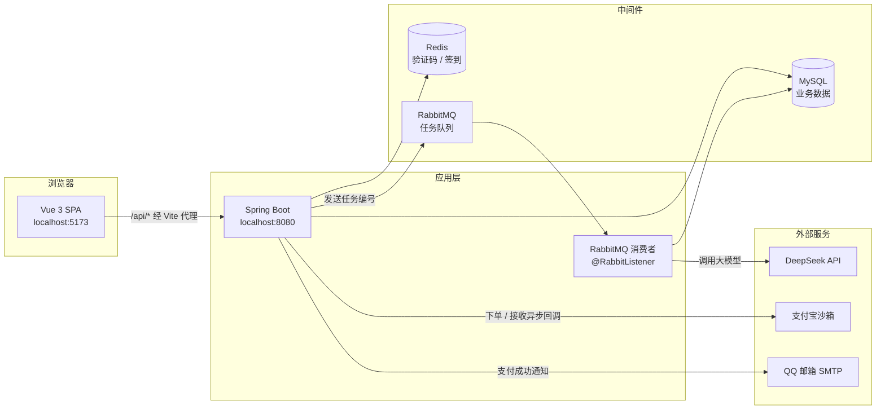
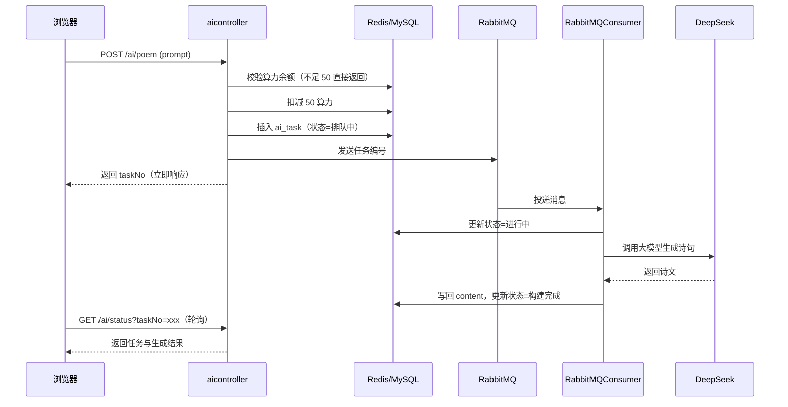
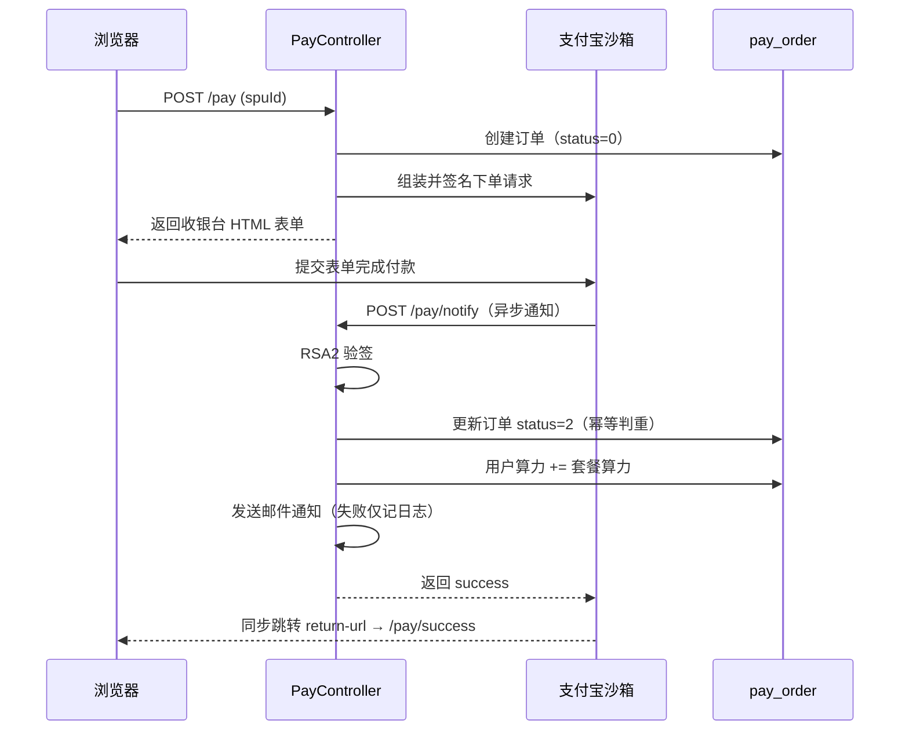

# AI 算力租赁平台

一个前后端分离的 **AI 诗歌创作 + 算力交易** 平台。

用户注册后通过**每日签到**或**购买算力套餐**获得算力，用算力提交 AI 写诗任务；任务经 RabbitMQ 异步投递给大模型，完成后落库并邮件通知。优质作品可上传至作品广场，按浏览量排序展示。

后端 Spring Boot 3 + MyBatis-Plus + MySQL + Redis + RabbitMQ，前端 Vue 3 + Vite，支付接入支付宝沙箱。

---

## 目录

- [功能特性](#功能特性)
- [技术栈](#技术栈)
- [系统架构](#系统架构)
- [快速开始](#快速开始)
- [目录结构](#目录结构)
- [核心业务流程](#核心业务流程)
- [接口文档](#接口文档)
- [已知问题](#已知问题)
- [开发日志](#开发日志)

---

## 功能特性

| 模块 | 能力 |
| --- | --- |
| 账号 | 注册、账号密码登录、**邮箱验证码登录**（Redis 存码，2 分钟有效）、退出登录 |
| 算力 | 每日签到领算力、算力余额校验与扣减、购买套餐充值 |
| AI 创作 | 提交写诗任务（Prompt → 大模型）、任务状态轮询、生成结果落库 |
| 作品广场 | 作品列表（按浏览量降序）、作品详情（浏览量 +1）、上传优质作品 |
| 套餐 | 已上架套餐列表、管理端增删改查与上下架 |
| 支付 | 支付宝沙箱网页支付、异步回调验签、支付成功自动加算力 |
| 通知 | 支付成功邮件通知（SMTP，失败不阻断主流程） |
| 管理端 | 用户查询与角色/算力调整、全量 AI 任务查看、套餐管理 |

---

## 技术栈

### 后端

| 组件 | 版本 | 说明 |
| --- | --- | --- |
| Spring Boot | **3.4.12** | 通过 BOM 引入，未继承 `spring-boot-starter-parent` |
| JDK | **17+** | 编译级别 17 |
| MyBatis-Plus | 3.5.9 | `mybatis-plus-spring-boot3-starter`（Boot 3 专用 starter） |
| Spring AI | 1.0.0 | `spring-ai-starter-model-deepseek` |
| 大模型 | `deepseek-chat` | 通过 Spring AI 调用 |
| MySQL | 8.x | `mysql-connector-j` |
| Redis | - | `spring-boot-starter-data-redis` + `commons-pool2` |
| RabbitMQ | - | `spring-boot-starter-amqp` |
| 邮件 | - | `spring-boot-starter-mail`（QQ 邮箱 SMTP） |
| 支付 | alipay-sdk-java 3.1.0 | 沙箱环境 |
| 其他 | Lombok 1.18.30、fastjson 1.2.62 | |

### 前端

| 组件 | 版本 |
| --- | --- |
| Vue | 3.5.13 |
| vue-router | 4.5.0 |
| Vite | 6.0.11 |

---

## 系统架构



> 前端统一以 `/api` 为前缀请求，由 Vite 代理转发到 `:8080` 并**抹掉 `/api`**。
> 浏览器视角前后端同源，因此 `JSESSIONID` Cookie 可正常携带 —— 后端未配置 CORS。

---

## 快速开始

### 环境要求

| 依赖 | 版本 |
| --- | --- |
| JDK | 17 及以上 |
| Maven | 3.6+ |
| Node.js | 18+ |
| MySQL | 8.x |
| Redis | 5+ |
| RabbitMQ | 3.x（含管理插件） |

### 1. 准备中间件

启动 MySQL、Redis、RabbitMQ。默认连接地址在 `application.yml` 中：

| 中间件 | 默认地址 |
| --- | --- |
| MySQL | `localhost:3306/ai-rent-platform` |
| Redis | `localhost:6379` |
| RabbitMQ | `localhost:5672` |

> 若中间件部署在其他主机，请同步修改 `ai-rent-platform/src/main/resources/application.yml`。

### 2. 初始化数据库

创建数据库：

```sql
CREATE DATABASE `ai-rent-platform` DEFAULT CHARACTER SET utf8mb4;
```

核心数据表：

| 表名 | 对应实体 | 用途 |
| --- | --- | --- |
| `user` | `User` | 用户、算力余额、邮箱、角色 |
| `token_spu` | `TokenSpu` | 算力套餐 |
| `pay_order` | `Order` | 支付订单 |
| `ai_task` | `AiTask` | AI 创作任务 |
| `ai_production` | `AiProduction` | 作品广场 |

字段定义可参考 `demos/web/pojo/` 下的实体类。

> ⚠️ 仓库内暂无建表 SQL 脚本，首次运行需自行建表。

### 3. 配置环境变量

`application.yml` 中所有敏感项均为 `${...}` 占位符，**6 个变量缺一不可，否则后端启动失败**：

| 变量 | 用途 | 来源 |
| --- | --- | --- |
| `DEEPSEEK_API_KEY` | 调用 DeepSeek | [DeepSeek 开放平台](https://platform.deepseek.com/) |
| `EMAIL` | 发件邮箱 | 你的邮箱地址 |
| `PWD` | 发件邮箱**授权码**（非登录密码） | 邮箱设置中开启 SMTP 后生成 |
| `ALIPAY_APP_ID` | 支付宝应用 ID | 支付宝开放平台沙箱应用 |
| `ALIPAY_APP_PRIVATE_KEY` | 应用私钥（PKCS8 单行 Base64） | 沙箱密钥工具生成 |
| `ALIPAY_PUBLIC_KEY` | 支付宝公钥 | 沙箱应用页面 |

PowerShell 写入用户级环境变量示例：

```powershell
[Environment]::SetEnvironmentVariable('DEEPSEEK_API_KEY', 'sk-xxxxxxxx', 'User')
[Environment]::SetEnvironmentVariable('EMAIL', 'you@qq.com', 'User')
[Environment]::SetEnvironmentVariable('PWD', 'your-smtp-auth-code', 'User')
[Environment]::SetEnvironmentVariable('ALIPAY_APP_ID', '9021xxxxxxxxxx', 'User')
[Environment]::SetEnvironmentVariable('ALIPAY_APP_PRIVATE_KEY', 'MIIEvQIBADANBg...', 'User')
[Environment]::SetEnvironmentVariable('ALIPAY_PUBLIC_KEY', 'MIIBIjANBgkq...', 'User')
```

> **重要**：Windows 进程的环境块在创建时即固定，修改环境变量后**必须完全退出并重启 IDE**（不是只重启应用），否则后端仍读到旧值。

### 4. 启动后端

```bash
cd ai-rent-platform
mvn spring-boot:run
```

服务运行于 `http://localhost:8080`。

### 5. 启动前端

```bash
cd frontend
npm install
npm run dev
```

访问 `http://localhost:5173`。

---

## 目录结构

```
ai-rent-platform/
├── ai-rent-platform/                 # 后端（Spring Boot）
│   ├── src/main/java/org/example/airentplatform/
│   │   ├── AiRentPlatformApplication.java
│   │   └── demos/web/
│   │       ├── controller/           # 接口层（6 个 Controller）
│   │       ├── service/              # 业务层（AI / 支付 / MQ）
│   │       ├── consumer/             # RabbitMQ 消费者
│   │       ├── mapper/               # MyBatis-Plus Mapper
│   │       ├── pojo/                 # 实体与统一响应 Result
│   │       ├── dto/                  # 请求 DTO
│   │       ├── confign/              # 配置类与拦截器注册
│   │       ├── intercepter/          # 登录 / 管理员拦截器
│   │       ├── payment/              # 支付宝接口抽象
│   │       └── utils/                # 邮件、随机数工具
│   └── src/main/resources/
│       └── application.yml
├── frontend/                         # 前端（Vue 3 + Vite）
│   ├── src/
│   │   ├── views/                    # 页面组件
│   │   ├── components/               # 通用组件
│   │   ├── router/                   # 路由与守卫
│   │   ├── store/                    # 登录态
│   │   ├── api.js                    # 接口封装
│   │   └── config.js                 # 前端可配置项
│   └── vite.config.js                # 端口与代理配置
├── API.md                            # 接口文档（25 个端点）
├── 开发日志.md                        # 开发过程记录
└── README.md
```

### 前端页面

| 路由 | 页面 | 权限 |
| --- | --- | --- |
| `/` | 首页 | 公开 |
| `/login` | 登录 / 注册 | 仅未登录 |
| `/profile` | 个人中心 | 登录 |
| `/ai` | AI 创作 | 登录 |
| `/gallery` | 作品广场 | 公开 |
| `/gallery/:id` | 作品详情 | 公开 |
| `/admin` | 管理后台 | 管理员 |
| `/pay/success` | 支付成功页 | 公开 |

---

## 核心业务流程

### AI 写诗链路（异步）



### 支付链路



> **`return-url` 与 `notify-url` 的区别**：
> `return-url` 由**用户浏览器**发起，指向前端 `localhost:5173`；
> `notify-url` 由**支付宝服务器**从公网发起，必须是**公网可达地址**。
> 若在本地调试异步回调，需借助内网穿透将公网地址映射到 `127.0.0.1:8080`。

---

## 接口文档

完整的 25 个 HTTP 端点（路径、参数、响应示例、权限矩阵、数据结构、已知问题）见 **[API.md](API.md)**。

接口按模块分组：

| 模块 | 前缀 | 端点数 |
| --- | --- | :---: |
| 认证 | `/check` | 5 |
| 用户 | `/user` | 4 |
| 套餐 | `/spu` | 1 |
| AI 创作 | `/ai` | 5 |
| 支付 | `/pay` | 2 |
| 管理端 | `/admin` | 8 |

**接入前务必注意**：

- 所有 POST 接口使用**表单参数**，用 JSON 提交会导致后端全部收到 `null`
- 统一响应 `{code, msg, data}` 中的 `code` 是**业务码**，HTTP 状态码通常为 `200`
- 存在若干非标准响应（空响应体、无 `code` 字段、返回 HTML 字符串等），详见 API.md 第 2.5 节

---

## 已知问题

以下均为当前代码中真实存在的限制，供二次开发参考：

| 级别 | 问题 | 说明 |
| --- | --- | --- |
| 🔴 | **密码明文存储** | `user.password` 未做哈希；`GET /user/profile` 会返回明文密码 |
| 🔴 | **邮箱登录空指针** | 用未绑定用户的邮箱登录时，`selectOne` 返回 `null` 后直接取值 → HTTP 500 |
| 🔴 | **`type` 参数缺省** | `type` 不传（默认 0）会落入邮箱登录分支 → 触发同一空指针 |
| 🟠 | **验证码非一次性** | 登录成功后未删除 Redis key，2 分钟内可重放 |
| 🟠 | **验证码可暴力枚举** | 无错误次数限制，可无限试错 |
| 🟠 | **发送验证码无频率限制** | 后端无冷却，前端倒计时可绕过，存在邮件轰炸风险 |
| 🟠 | **签到非原子操作** | `Redis 校验 + 写 key` 非原子，并发下可能重复发放算力 |
| 🟡 | **`devtools` 仍在依赖中** | 生产打包前应移除，否则异常响应会携带完整堆栈 |
| 🟡 | **`notify-url` 硬编码** | 订阅地址写死在 `application.yml`，建议改为环境变量 |

---

## 开发日志

项目开发过程与踩坑记录见 [`开发日志.md`](开发日志.md)。

---

## License

本项目仅用于学习与技术演示。支付宝相关能力运行在**沙箱环境**，不涉及真实资金。
